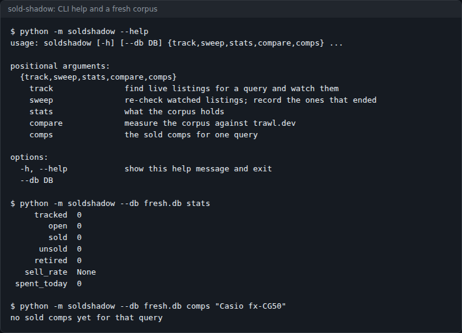
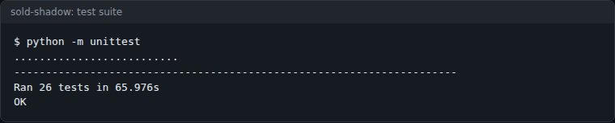
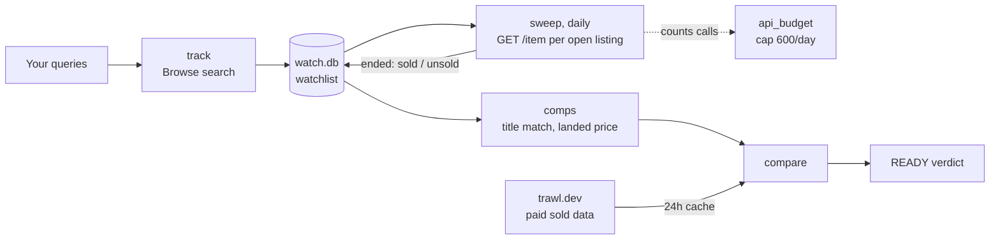

# sold-shadow

Build your own eBay sold-comp corpus from the official Browse API, then measure whether it can replace the paid sold-data source you use now. Python stdlib only.



[](LICENSE)


eBay's completed-listing search is closed. Everything free gives you *asking* prices, and an ask is an opinion. The paid resellers of sold data are metered (the one this was built against allows 250 requests a month). So this does the slow thing instead: it watches live listings until they end and records the ones that sold. And because "can I stop paying now?" is an empirical question, it ships with the harness that answers it.

## Contents

- [What it does](#what-it-does)
- [Screenshots](#screenshots)
- [Quick start](#quick-start)
- [Usage](#usage)
- [Configuration](#configuration)
- [How it works](#how-it-works)
- [Status, limits and real results](#status-limits-and-real-results)
- [Licence and credits](#licence-and-credits)

## What it does

- `track` searches live eBay listings for the queries **you** choose and adds them to a SQLite watchlist.
- `sweep` re-fetches open listings once a day and records which ones ended, sold or ended unsold, with the sold date, price and postage.
- `comps` returns the sold comps for a query, in landed terms (price plus postage), matched by title rather than by the search string.
- Stores best-offer sales with a flag and keeps them out of `comps` unless you ask (`--include-best-offer`), because their real price is never exposed.
- Counts its own Browse API spend and stops at a daily cap (600 calls), well under eBay's 5,000/day allowance.
- `compare` asks the paid source the same queries and prints a READY / not-ready verdict against a fixed bar: 80% coverage and medians within 15%.

There is no category sweep and no "track everything" mode. The quota is finite, and a corpus of products you will never sell is worth nothing.

## Screenshots

| | |
|---|---|
|  |  |
| `--help`, then `stats` and `comps` against a fresh database. Captured 2026-10-08. | The test suite from a fresh clone: 26 tests, OK. Captured 2026-10-08. |

There is no screenshot of a populated corpus: the install the measurements below come from is private, and this repo ships no sample data.

## Quick start

You need Python 3.11 or newer and an eBay developer keyset. There is nothing to install.

```bash
git clone https://github.com/casareanderson/sold-shadow
cd sold-shadow
python -m unittest                     # 26 tests, no network, no token
python -m soldshadow --help
```

Then get an **application token** (client credentials grant, no user consent) for the Browse API, and start tracking:

```bash
export EBAY_TOKEN="<your client-credentials token>"
python -m soldshadow track "Casio fx-CG50"
python -m soldshadow stats
```

Success looks like `track` printing a result for each query and `stats` showing a non-zero `tracked` count. `comps` will say `no sold comps yet for that query` for days or weeks: listings have to end before there is anything to record.

## Usage

```bash
python -m soldshadow track "Casio FX-CG50 graphing calculator"
python -m soldshadow track "Casio fx-CG50"       # a second phrasing of the same product
python -m soldshadow track -f queries.txt        # one per line; lines starting # are skipped

python -m soldshadow sweep                       # daily, from cron
python -m soldshadow stats
python -m soldshadow comps "Casio FX-CG50 graphing calculator"
python -m soldshadow comps "Casio fx-CG50" --include-best-offer --window-days 90
```

`comps` prints one line per sale: landed price, sold date and title.

A daily sweep from cron, before your own quota resets:

```cron
40 6 * * *  cd /opt/sold-shadow && python -m soldshadow sweep >> sweep.log 2>&1
```

### Measuring it against what you pay for

```bash
export TRAWL_KEY="<your trawl.dev key>"
python -m soldshadow compare -f queries.txt
```

`compare` prints one row per query with these columns, then a verdict line:

| Column | Meaning |
|---|---|
| `ours` | Clean sold comps in this corpus |
| `bound` | Best-offer sales (upper bounds), counted as evidence in their own column |
| `trawl` | Sold comps the paid source returned |
| `ourMed`, `theirMed` | Medians, in GBP |
| `gap` | How far our median sits from theirs, as a percentage of theirs |

The last line reads `READY: True` or `READY: False` with the reason, for example `coverage 20% of 5 answerable quer(ies) - need 80%`. A query counts as covered when `ours + bound` is at least 3.

It spends one paid request per uncached query, on purpose: proving you can stop paying for something is a fair use of the last of it. Results are cached for 24 hours, so re-running the same day is free, and a run is capped at 10 queries. `compare` is the only part that talks to a paid service; nothing else needs it.

## Configuration

| Name | Default | What it does |
|---|---|---|
| `EBAY_TOKEN` | none (required for `track`, `sweep`) | eBay application token for the Browse API, client credentials grant |
| `TRAWL_KEY` | none (required for `compare`) | API key for the paid source, trawl.dev, sent as `x-api-key` |
| `SOLDSHADOW_DB` / `--db` | `watch.db` | SQLite file holding the watchlist, the daily spend counter and the paid-source cache |
| `track --limit` | 200 | Listings to enrol per query |
| `sweep --limit` | 120 | Open listings to re-check per run |
| `--window-days` (`comps`, `compare`) | 60 | How far back a sale counts |
| `DAILY_CALL_CAP` in `watch.py` | 600 | The sweep's own daily ceiling on Browse calls |
| `MIN_COVERAGE`, `MAX_MEDIAN_DELTA` in `shadow.py` | 0.80, 15.0 | The switch-off bar `compare` tests against |
| `CACHE_TTL_S` in `trawl.py` | 24 h | How long a paid-source answer is reused |

## How it works

**The finding it rests on.** An ended eBay listing does not disappear from the API. `GET /item/{itemId}` returns HTTP 200 with `itemEndDate` set, and the outcome is readable:

```
OUT_OF_STOCK, estimatedRemainingQuantity 0, estimatedSoldQuantity >= 1  -> SOLD
IN_STOCK,     estimatedRemainingQuantity 1, estimatedSoldQuantity 0     -> ended unsold
```

This was checked on 30 real listings re-fetched 6 to 8 days after capture: 30 of 30 returned 200, two had ended, and one of those had sold. Everything goes through the Browse API with an application token. There is no scraping and nothing outside the eBay API License Agreement.



```
sold-shadow/
├── soldshadow/
│   ├── __main__.py   the CLI: track, sweep, stats, comps, compare
│   ├── watch.py      Browse search, the sweep, outcome reading, title matching, comps
│   ├── store.py      SQLite schema: watchlist, api_budget, trawl_cache
│   ├── shadow.py     the comparison and the switch-off bar
│   ├── trawl.py      the paid sold-data client and its cache
│   └── comp.py       the Comp record
├── tests/            26 unittest tests, offline
└── docs/             README images
```

Both HTTP clients send a `curl/8.5.0` user agent, because Cloudflare rejects Python's default one with error 1010 on both `api.ebay.com` and trawl.dev.

## Status, limits and real results

### Measured

Numbers from the private install this was extracted from, on **2026-09-12** (evening), after about a week of daily sweeps:

| | |
|---|---|
| listings tracked | **3,190** |
| distinct queries | **54** |
| confirmed **sold** | **14** |
| of which best-offer (upper bounds) | **9** |
| **usable** sold comps | **5** |
| queries with at least one usable comp | **5 / 54 = 9%** |

Against the bar in `shadow.py` (80% coverage, within 15% of the paid source's median), the verdict on that install was: **not close**. One query had a real cluster (four Casio FX-CG50 sales in four days); the rest were n=1. A corpus matures or it is nothing, and the only way to know which you have is to measure it.

### Four things that will bite you

**There is no backfill, ever.** Search returns active listings only. A sale that completed before you started watching is gone. The most useful thing you can do with this repo is start it today and leave it for a month.

**Best-offer sales are upper bounds, not prices.** eBay never exposes an accepted offer; the ended listing still shows its ask. On the data above that was 9 of 14 sales, so excluding them costs 64% of your comps, and including them prices against a number nobody paid. They are stored with a flag, left out of `sold_comps()` by default, and returned by `best_offer_comps()` so a caller can use them as a ceiling.

Read what the flag means before deciding. It is set from `"BEST_OFFER" in buyingOptions`, which says the *listing accepted offers*, not that this sale went through one. On eBay UK that is most used fixed-price listings. The one product holding both kinds (a Casio FX-CG50: one clean sale at £89.99, three best-offer asks at £80.00, £83.90 and £88.99) had the excluded asks sitting *below* the clean sale, so discarding them was not the conservative choice it looked like. That is why `compare` counts them toward coverage in their own `bound` column.

**Auctions carry `itemEndDate` from the moment they are created.** "Live listings have a null end date" is true for fixed-price only. An earlier version filed every auction as ended unsold while it was still taking bids, and never looked at it again, so auctions could never contribute a comp and the corpus was biased upward. A *future* end date now leaves the row open.

**One search string finds one slice.** eBay UK holds about twenty live listings of any mid-volume used product at once, and one query does not see them all: the same case is listed as "Argon ONE M.2", "Raspberry Pi Argon One With" and "Argon One V2 aluminium", and each phrasing returns a different subset. Measured on the same install, adding a second and third phrasing for the same product in one sweep:

| product | one phrasing | up to three |
|---|---|---|
| Apple Magic Mouse | 210 | **388** |
| Casio fx-CG50 | 18 | **104** |
| Xiaomi TV Box S | 36 | **81** |
| Raspberry Pi Argon ONE | 23 | **23** |

Sweep-wide that was **+640 listings for +100 calls**. The Argon did not move because there was nothing more to find: phrasings raise volume, but they do not fix a niche product; only time does. Two rules from the same run: keep a phrasing to **eight words or fewer** (a long string ANDs every word and returns less), and cap it at **three per product** so a sweep of thirty products stays under a hundred searches. `comps` and `compare` match by title, so a listing enrolled under any phrasing is found from any of them.

### What this deliberately is not

It does not scrape, reverse-engineer or replicate where any paid sold-comps service gets its data. The comparison in `shadow.py` is against a paid service's **output**, which you have paid for and are entitled to read. It was extracted from a larger private listing tool; the parts that decided *what* to track from that tool's own database were removed rather than generalised.

## Licence and credits

MIT, see [LICENSE](LICENSE). Issues and pull requests are welcome.

Data comes from the eBay Browse API under your own keyset and the eBay API License Agreement. `compare` reads trawl.dev under your own subscription.

The wider write-up (which second-hand price sources are real, which are opinions, and what the paid ones give you): [The Price Data Playbook](https://asareanderson.gumroad.com/l/jqeejh) (£19). More field notes: [dev.to/c1-anderson](https://dev.to/c1-anderson).
